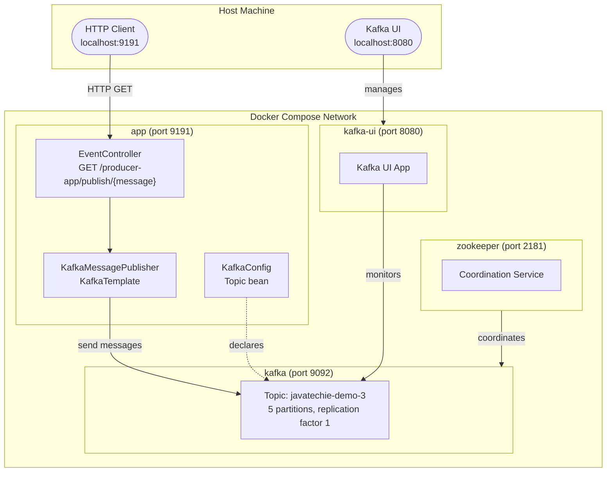
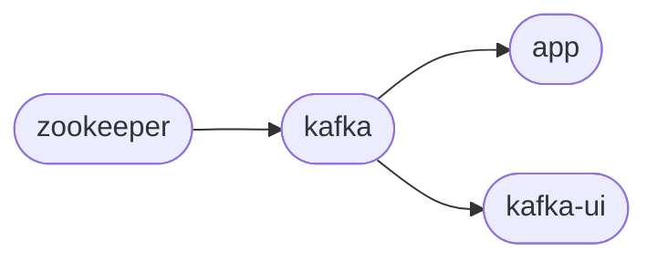

# kafka-producer-example

A Spring Boot application that exposes a REST endpoint and publishes messages to an Apache Kafka topic. The full environment (Zookeeper, Kafka broker, Spring Boot app, and Kafka UI) is orchestrated with Docker Compose.

---

## Table of Contents

1. [Overview](#overview)
2. [Technology Stack](#technology-stack)
3. [System Architecture](#system-architecture)
4. [Project Structure](#project-structure)
5. [Application Flow](#application-flow)
6. [Configuration](#configuration)
7. [Docker Setup](#docker-setup)
   - [Dockerfile](#dockerfile)
   - [docker-compose.yml](#docker-composeyml)
   - [Service Details](#service-details)
8. [Running the Application](#running-the-application)
   - [Prerequisites](#prerequisites)
   - [Option 1 – Docker Compose (recommended)](#option-1--docker-compose-recommended)
   - [Option 2 – Local (requires a running Kafka broker)](#option-2--local-requires-a-running-kafka-broker)
9. [REST API](#rest-api)
10. [Kafka UI](#kafka-ui)
11. [Testing](#testing)

---

## Overview

This project demonstrates how to produce messages to an Apache Kafka topic through a simple Spring Boot REST API. When a `GET` request hits the `/producer-app/publish/{message}` endpoint, the application sends **10,001 copies** of the supplied message (suffixed with an incrementing index) to the Kafka topic `javatechie-demo-3`, which has 5 partitions. This load allows you to observe how Kafka distributes messages across partitions.

---

## Technology Stack

| Component         | Technology                              |
|-------------------|-----------------------------------------|
| Language          | Java 17                                 |
| Framework         | Spring Boot 3.0.5                       |
| Messaging         | Apache Kafka (via Spring Kafka)         |
| Build tool        | Maven                                   |
| Container runtime | Docker & Docker Compose                 |
| Kafka broker      | Confluent Platform `cp-kafka:7.4.0`     |
| Zookeeper         | Confluent Platform `cp-zookeeper:7.4.0` |
| Kafka UI          | `provectuslabs/kafka-ui:latest`         |
| Unit tests        | JUnit 5 + Mockito                       |
| BDD tests         | Cucumber 7                              |

---

## System Architecture



---

## Project Structure

```
kafka-producer-example/
├── Dockerfile                          # Builds the Spring Boot container image
├── docker-compose.yml                  # Orchestrates all services
├── pom.xml                             # Maven project descriptor
└── src/
    ├── main/
    │   ├── java/com/javatechie/
    │   │   ├── SpringKafkaProducerApplication.java   # Entry point
    │   │   ├── config/
    │   │   │   └── KafkaConfig.java                  # Topic creation bean
    │   │   ├── controller/
    │   │   │   └── EventController.java              # REST endpoint
    │   │   └── service/
    │   │       └── KafkaMessagePublisher.java        # Kafka send logic
    │   └── resources/
    │       └── application.yml                       # App configuration
    └── test/
        ├── java/com/javatechie/
        │   ├── config/KafkaConfigTest.java
        │   ├── controller/EventControllerTest.java
        │   ├── service/KafkaMessagePublisherTest.java
        │   └── cucumber/
        │       ├── CucumberRunnerTest.java
        │       ├── CucumberSpringConfiguration.java
        │       └── KafkaProducerStepDefinitions.java
        └── resources/features/
            └── kafka-producer.feature                # BDD scenarios
```

---

## Application Flow

```mermaid
flowchart TD
    A([HTTP Client]) -->|GET /producer-app/publish/{message}| B[EventController\nREST layer – Spring MVC]
    B -->|"for i = 0 to 10,000\npublisher.sendMessageToTopic(message + ' : ' + i)"| C[KafkaMessagePublisher\nService layer]
    C -->|"KafkaTemplate.send('javatechie-demo-3', message)\nreturns CompletableFuture<SendResult>"| D[(Kafka Broker\nport 9092)]
    D --> E[("Topic: javatechie-demo-3\nPartitions: 5 | Replication factor: 1")]
    E --> F([Messages stored\nin topic partitions])
    C -- success callback --> G[/Log offset/]
    C -- failure callback --> H[/Log error/]
```

### Step-by-step description

1. **HTTP request** – A client sends a `GET` request to `http://localhost:9191/producer-app/publish/<message>`.
2. **`EventController`** – Receives the request and loops 10,001 times, calling `publisher.sendMessageToTopic(message + " : " + i)` on each iteration.
3. **`KafkaMessagePublisher`** – Invokes `KafkaTemplate.send(topic, message)`. Spring Kafka serialises the `String` payload and hands it to the underlying Kafka producer client. The call returns a `CompletableFuture`.
4. **Async callback** – When the broker acknowledges the write (or if an error occurs), the `whenComplete` callback logs the offset on success or the exception message on failure.
5. **Kafka broker** – Stores each message in one of the 5 partitions of the `javatechie-demo-3` topic using the default round-robin / hash-based partitioner.
6. **Response** – Once the loop finishes dispatching all messages, `EventController` returns HTTP 200 with the body `"Messages published successfully."`. If any exception is thrown before or during the loop, HTTP 500 is returned.

### Key classes

| Class | Package | Responsibility |
|-------|---------|----------------|
| `SpringKafkaProducerApplication` | `com.javatechie` | Bootstrap the Spring Boot context |
| `KafkaConfig` | `com.javatechie.config` | Declare the `javatechie-demo-3` topic (5 partitions, 1 replica) as a Spring `@Bean` so that it is auto-created on startup |
| `EventController` | `com.javatechie.controller` | Expose `GET /producer-app/publish/{message}` and drive the publish loop |
| `KafkaMessagePublisher` | `com.javatechie.service` | Wrap `KafkaTemplate` and handle the async send result |

---

## Configuration

**`src/main/resources/application.yml`**

```yaml
server:
  port: 9191                    # HTTP port the app listens on

spring:
  kafka:
    producer:
      bootstrap-servers: localhost:9092          # Kafka broker address
      key-serializer: org.apache.kafka.common.serialization.StringSerializer
      value-serializer: org.apache.kafka.common.serialization.StringSerializer
```

> **Note:** When running inside Docker Compose the `bootstrap-servers` value must point to the broker's **internal** Docker network hostname (`kafka:9092`). This is injected at runtime via an environment variable – see the `app` service in `docker-compose.yml`.

---

## Docker Setup

### Dockerfile

```dockerfile
FROM eclipse-temurin:17-jdk          # Base image: OpenJDK 17
WORKDIR /app                          # Working directory inside the container
COPY target/kafka-producer-example-0.0.1-SNAPSHOT.jar app.jar
EXPOSE 9191                           # Documents the port (matched by docker-compose)
ENTRYPOINT ["java","-jar","app.jar"]  # Launch the fat JAR
```

The image is intentionally minimal – it copies only the pre-built JAR produced by Maven. **You must run `mvn clean package -DskipTests` before `docker-compose up --build`** so that the JAR exists in `target/`.

### docker-compose.yml

```yaml
version: '3.8'
services:

  zookeeper:
    image: confluentinc/cp-zookeeper:7.4.0
    environment:
      ZOOKEEPER_CLIENT_PORT: 2181
    ports:
      - "2181:2181"

  kafka:
    image: confluentinc/cp-kafka:7.4.0
    depends_on:
      - zookeeper
    ports:
      - "9092:9092"
    environment:
      KAFKA_BROKER_ID: 1
      KAFKA_ZOOKEEPER_CONNECT: zookeeper:2181
      KAFKA_LISTENERS: PLAINTEXT://0.0.0.0:9092
      KAFKA_ADVERTISED_LISTENERS: PLAINTEXT://localhost:9092

  app:
    build: .
    depends_on:
      - kafka
    ports:
      - "9191:9191"
    environment:
      SPRING_KAFKA_PRODUCER_BOOTSTRAP_SERVERS: kafka:9092

  kafka-ui:
    image: provectuslabs/kafka-ui:latest
    container_name: kafka-ui
    ports:
      - "8080:8080"
    depends_on:
      - kafka
    environment:
      KAFKA_CLUSTERS_0_NAME: local
      KAFKA_CLUSTERS_0_BOOTSTRAPSERVERS: kafka:9092
```

### Service Details

| Service      | Image / Build             | Internal port | Host port | Purpose |
|--------------|---------------------------|---------------|-----------|---------|
| `zookeeper`  | `cp-zookeeper:7.4.0`      | 2181          | 2181      | Coordination service required by the Kafka broker |
| `kafka`      | `cp-kafka:7.4.0`          | 9092          | 9092      | The Kafka message broker |
| `app`        | Built from local `Dockerfile` | 9191      | 9191      | The Spring Boot producer application |
| `kafka-ui`   | `kafka-ui:latest`         | 8080          | 8080      | Web-based Kafka management console |

#### Start-up dependency chain



Docker Compose starts services in dependency order. The `kafka` service waits for `zookeeper`, while both `app` and `kafka-ui` wait for `kafka` to be available before starting.

#### Networking

All four services share the default Compose network. Within that network:

* The Spring Boot app connects to the broker using `kafka:9092` (container-to-container).
* The host machine accesses the broker on `localhost:9092` (mapped host port).
* `KAFKA_ADVERTISED_LISTENERS: PLAINTEXT://localhost:9092` is correct for host-to-broker access. For container-to-container communication, the `app` service overrides `bootstrap-servers` via the environment variable `SPRING_KAFKA_PRODUCER_BOOTSTRAP_SERVERS=kafka:9092` so the Spring Boot app resolves the broker inside the Docker network.

---

## Running the Application

### Prerequisites

* **Java 17** and **Maven 3.8+** (for building the JAR)
* **Docker** and **Docker Compose** (for the containerised environment)

### Option 1 – Docker Compose (recommended)

```bash
# 1. Build the Spring Boot fat JAR (skipping tests for speed)
mvn clean package -DskipTests

# 2. Build the Docker image and start all services
docker-compose up --build

# 3. Wait until you see "Started SpringKafkaProducerApplication" in the logs,
#    then verify the app is running (in a new terminal)
curl http://localhost:9191/producer-app/publish/hola
# Expected response: Messages published successfully.
```

To stop all services:

```bash
docker-compose down
```

To stop and remove volumes (wipe Kafka data):

```bash
docker-compose down -v
```

### Option 2 – Local (requires a running Kafka broker)

```bash
# 1. Start only Kafka infrastructure via Docker Compose
docker-compose up zookeeper kafka

# 2. Run the Spring Boot app with Maven
mvn spring-boot:run

# 3. Publish a test message
curl http://localhost:9191/producer-app/publish/hello
```

---

## REST API

### Publish messages

| Attribute   | Value |
|-------------|-------|
| Method      | `GET` |
| URL         | `/producer-app/publish/{message}` |
| Path param  | `message` – arbitrary string payload |
| Success     | `200 OK` – body: `Messages published successfully.` |
| Error       | `500 Internal Server Error` |

**Example request:**

```bash
curl http://localhost:9191/producer-app/publish/hola
```

**What happens:** 10,001 messages of the form `"hola : 0"`, `"hola : 1"`, …, `"hola : 10000"` are published to the `javatechie-demo-3` topic asynchronously.

---

## Kafka UI

Kafka UI is available at **[http://localhost:8080](http://localhost:8080)** once Docker Compose is running.

Use it to:

* Browse topics and their partitions
* Inspect messages in real time
* Monitor consumer groups and broker metrics
* Verify that the `javatechie-demo-3` topic was auto-created with 5 partitions

---

## Testing

The project contains three layers of automated tests.

### Unit tests (JUnit 5 + Mockito)

```bash
mvn test
```

| Test class | What it verifies |
|------------|-----------------|
| `KafkaConfigTest` | `KafkaConfig.createTopic()` returns a `NewTopic` with the correct name, partition count, and replication factor |
| `KafkaMessagePublisherTest` | `sendMessageToTopic` delegates to `KafkaTemplate.send` and handles both success and failure callbacks |
| `EventControllerTest` | `GET /producer-app/publish/{message}` returns `200` on success and `500` when the publisher throws |

### BDD tests (Cucumber 7)

```bash
mvn test -Dcucumber.filter.tags=@integration   # or just: mvn test
```

Scenarios are defined in `src/test/resources/features/kafka-producer.feature`:

| Scenario | Validates |
|----------|-----------|
| Successfully publish a message | Service layer happy path |
| Handle publishing failure | Service layer error path |
| Successfully publish via REST endpoint | Full REST → service integration |

### CI / CD

GitHub Actions workflows run automatically on every push:

* `.github/workflows/junit-tests.yml` – executes the JUnit 5 tests
* `.github/workflows/cucumber-tests.yml` – executes the Cucumber BDD tests
